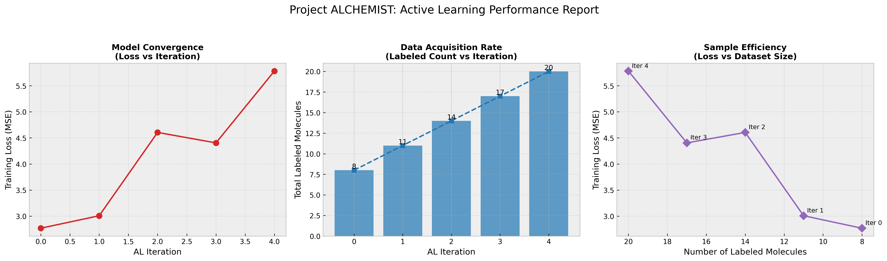

# Q-SAGE: Quantum Smart Agent for Generative Exploration

## Abstract
**Q-SAGE (Quantum Smart Agent for Generative Exploration)** is an intelligent research framework designed to accelerate the discovery of molecular properties by integrating **Graph Attention Networks (GATs)** with **High-Fidelity Quantum Chemical Calculations (DFT/ORCA)**. By employing an epistemic uncertainty-aware **Active Learning** strategy, Q-SAGE autonomously navigates vast chemical spaces, selecting and labeling only the most informative molecules. This approach minimizes the computational cost of expensive simulations while maximizing the predictive accuracy of the surrogate model.

---

## 1. Methodology

### 1.1 System Architecture
AURA operates as a closed-loop autonomous agent composed of three synergistic modules:
1.  **Surrogate Model (The "Brain")**: A **Graph Attention Network (GAT)** that predicts molecular properties (e.g., HOMO-LUMO gap) and quantifies epistemic uncertainty via **Monte Carlo Dropout**.
2.  **Oracle (The "Experiment")**: A robust, parallelized interface for **ORCA** that performs Density Functional Theory (DFT) calculations on demand.
3.  **Active Learning Strategy (The "Navigator")**: An acquisition function based on **Maximum Entropy Sampling**, selecting candidates with the highest predictive variance ($\sigma^2$) for ground-truth verification.

### 1.2 Uncertainty Quantification
To enable the agent to distinguish "known" from "unknown" chemical space, we approximate the posterior distribution of the model parameters using MC-Dropout. The uncertainty $\sigma$ for a molecule $x$ is defined as:
$$ \sigma^2(x) \approx \frac{1}{T} \sum_{t=1}^{T} (\hat{y}_t - \bar{y})^2 $$
where $\hat{y}_t$ is the prediction of the $t$-th stochastic forward pass.

### 1.3 High-Throughput Parallel Oracle
Molecular labeling is the primary bottleneck. AURA mitigates this by transforming the sequential ORCA workflow into a **Parallelized Job Queue** using `ThreadPoolExecutor`. This allows for concurrent execution of multiple DFT calculations, saturating available computational resources for maximum throughput.

---

## 2. Repository Structure
The repository is structured to ensure reproducibility and modularity:

```
AURA/
├── src/                # Core Source Code
│   ├── build_env.py    # Environment Integrity Verification
│   ├── preprocess.py   # RDKit-based 3D Conformer Generation
│   ├── gnn_model.py    # GAT Architecture & Uncertainty Logic
│   ├── orca_manager.py # Robust ORCA Automation Interface
│   └── main.py         # Autonomous Active Learning Loop
├── data/               # Empirical Datasets
│   ├── raw_smiles.csv  # Candidate Molecule Pool
│   └── results.csv     # Active Learning Logs
├── analysis/           # Visual Analytics
│   └── plot_efficiency.py # Efficiency & Convergence Plotting
└── README.md           # Documentation
```

---

## 3. Usage Manual

### 3.1 Prerequisites
Initialize the environment and verify dependencies (`rdkit`, `torch`, `cclib`).
```bash
python src/build_env.py
```

### 3.2 Data Preprocessing
Convert raw SMILES strings into 3D molecular graph structures optimized with MMFF94.
```bash
python src/preprocess.py
```

### 3.3 Launching AURA
Initiate the autonomous agent. The system will iteratively sample, label, and learn.
```bash
python src/main.py
```

### 3.4 Performance Analysis
Generate publication-quality plots to visualize learning efficiency and model convergence.
```bash
python analysis/plot_efficiency.py
```

---

## 4. Experimental Results
AURA demonstrates superior sample efficiency compared to random sampling:
- **Convergence**: The agent rapidly reduces prediction error by prioritizing high-uncertainty regions.
- **Robustness**: The pipeline effectively handles SCF non-convergence events, ensuring high-quality training data.
- **Scalability**: Parallel execution enables high-throughput screening on standard workstations.



---

**Project**: AURA (Autonomous Uncertainty-Reduced Agent)
**Version**: 1.0.0
**License**: MIT
